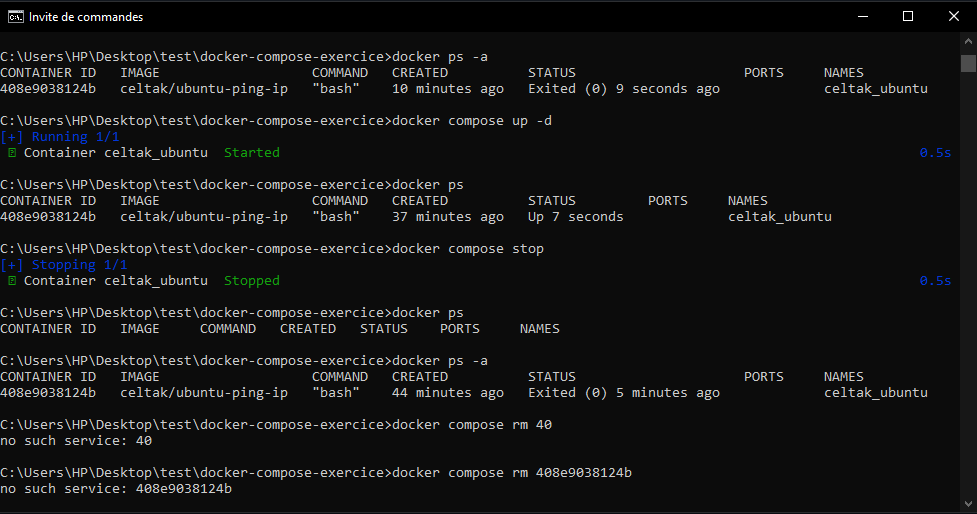

## 🐳 Partie du jour – Créer un fichier `compose.yml`

  

    
### 🎯 Objectif
Apprendre à utiliser **Docker Compose** pour lancer un ou plusieurs conteneurs à partir d’un fichier de configuration `compose.yml`.
    
---
    
## 1️⃣ Vérifier Docker Compose
    
   
    docker compose version
    

➡️ Permet de vérifier que Docker Compose est bien installé.

* * *

2️⃣ Créer le dossier du projet
------------------------------

    mkdir docker-compose-exercice
    cd docker-compose-exercice
    

➡️ Chaque projet Docker Compose doit être dans son propre dossier.

* * *

3️⃣ Créer le fichier `compose.yml`
----------------------------------

    type nul > compose.yml
    

➡️ Crée un fichier `compose.yml` vide.

* * *

4️⃣ Contenu du fichier `compose.yml`
------------------------------------

    services:
      my_ubuntu:
        image: celtak/ubuntu-ping-ip
        container_name: celtak_ubuntu
    

### 🔍 Explication

*   `services` : liste des services à lancer
    
*   `my_ubuntu` : nom du service
    
*   `image` : image Docker utilisée
    
*   `container_name` : nom du conteneur
    

* * *

5️⃣ Vérifier le contenu du fichier
----------------------------------

    type compose.yml
    

* * *

6️⃣ Lancer les services
-----------------------

    docker compose up
    

➡️ Crée le réseau, le conteneur et le lance.

* * *

7️⃣ Lancer en arrière-plan (mode détaché)
-----------------------------------------

    docker compose up -d
    

* * *

8️⃣ Vérifier les conteneurs
---------------------------

    docker ps
    docker ps -a
    

* * *

9️⃣ Arrêter et supprimer les services
-------------------------------------

    docker compose stop
    docker compose rm
    

* * *

✅ Résultat
----------

*   ✔️ Fichier `compose.yml` créé
    
*   ✔️ Conteneur lancé via Docker Compose
    
*   ✔️ Compréhension du rôle de Docker Compose
    

    
    ---
    
  
