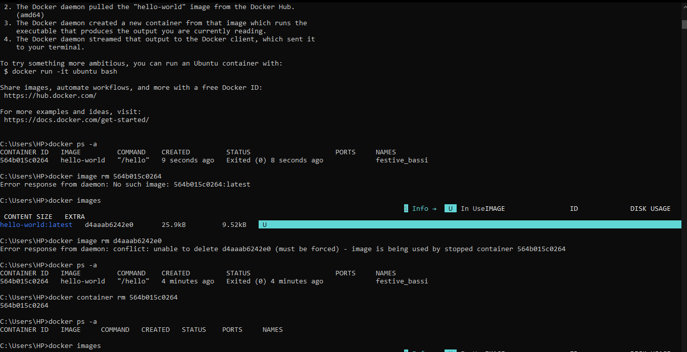

# 🐳 Session d'apprentissage Docker
<p align="center">
   
</p>

Ce document résume les commandes Docker de base apprises lors de mes tests sous Windows. Il couvre la vérification de l’installation, la gestion des conteneurs et la suppression des images.

---

## 🎯 Ce que j’ai appris

### 1️⃣ Commandes de base
- `docker --version` : vérifier que Docker est installé  
- `docker run <image>` : lancer un conteneur  
- `docker ps -a` : afficher tous les conteneurs  
- `docker images` : lister les images Docker  

---

### 2️⃣ Gestion des conteneurs
- `docker rm <id-conteneur>` permet de supprimer un conteneur  
- On peut utiliser l’ID complet ou seulement les premiers caractères  
- `docker container rm` est équivalent à `docker rm`  

---

### 3️⃣ Gestion des images
- `docker rmi <id-image>` supprime une image Docker  
- Il faut supprimer les conteneurs avant l’image  
- `docker rmi` et `docker image rm` font la même chose  

---

### 4️⃣ Points importants
- Une image ne peut pas être supprimée si un conteneur l’utilise  
- L’ordre correct est : conteneurs puis images  
- `hello-world` est une image de test qui s’arrête automatiquement  

---

## 📝 Commandes connues

```bash
# Vérification
docker --version

# Exécution
docker run hello-world

# Inspection
docker ps -a
docker images

# Nettoyage
docker rm <id-conteneur>
docker rmi <id-image>

# Alias
docker container ls -a
docker container rm <id>
docker image rm <id>

