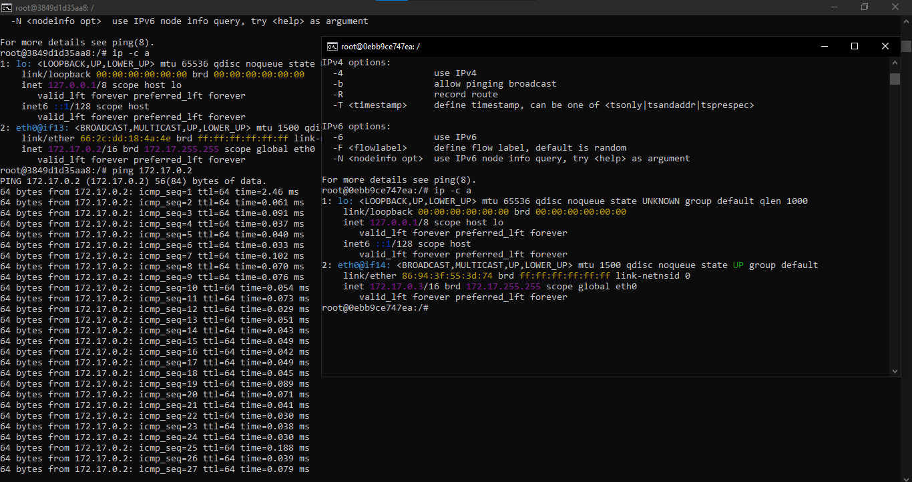
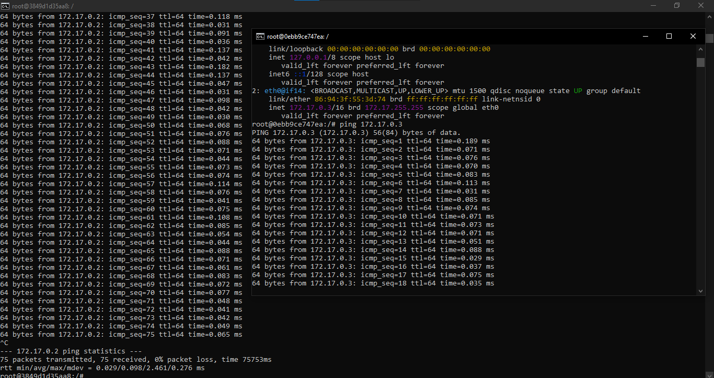

# 🐳 Apprentissage Docker – Conteneurs connectés

<p align="center">
  
  
</p>

Ce dépôt documente mon apprentissage de Docker, en particulier la **communication réseau à l’intérieur d’un conteneur**.  
L’objectif est de comprendre comment un conteneur fonctionne, comment inspecter son réseau et tester la connectivité.

---

## 🎯 Objectif de cette session

- Lancer un conteneur en mode interactif
- Installer des outils réseau dans un conteneur
- Comprendre l’interface réseau Docker
- Tester la connectivité avec `ping`

---

## 🧱 Lancement du conteneur

```bash
docker run --rm -it ubuntu
````

* `--rm` : supprime automatiquement le conteneur après l’arrêt
* `-it` : mode interactif avec terminal
* `ubuntu` : image utilisée

---

## 📦 Installation des outils réseau

```bash
apt update
apt install -y iputils-ping
apt install -y iproute2
```

Ces outils permettent :

* d’utiliser `ping`
* d’inspecter les interfaces réseau avec `ip`

---

## 🌐 Inspection du réseau

```bash
ip a
ip -c a
```

Ces commandes affichent :

* les interfaces réseau
* l’adresse IP du conteneur (ex : `172.17.x.x`)
* l’interface `eth0` fournie par Docker

---

## 📡 Test de connectivité

```bash
ping 172.17.0.3
```

* Vérifie que le conteneur peut communiquer via le réseau Docker
* Confirme que la pile réseau fonctionne correctement

---

## 📝 Points clés appris

* Chaque conteneur possède sa propre adresse IP
* Docker fournit un réseau interne par défaut
* Les outils réseau ne sont pas toujours installés par défaut
* `--rm` permet de garder un environnement propre

---

## 📚 Prochaine étape

* Communication entre **deux conteneurs**
* Réseaux Docker personnalisés
* Connexion entre conteneurs via nom
* Docker Compose

---
