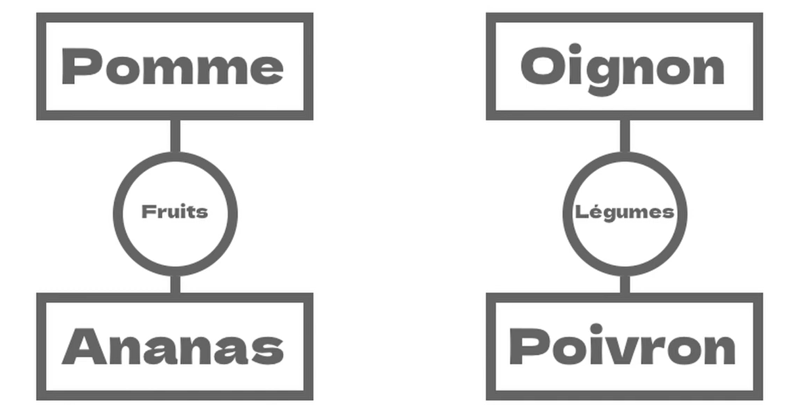
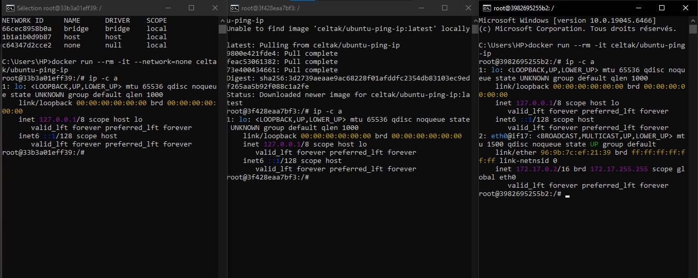
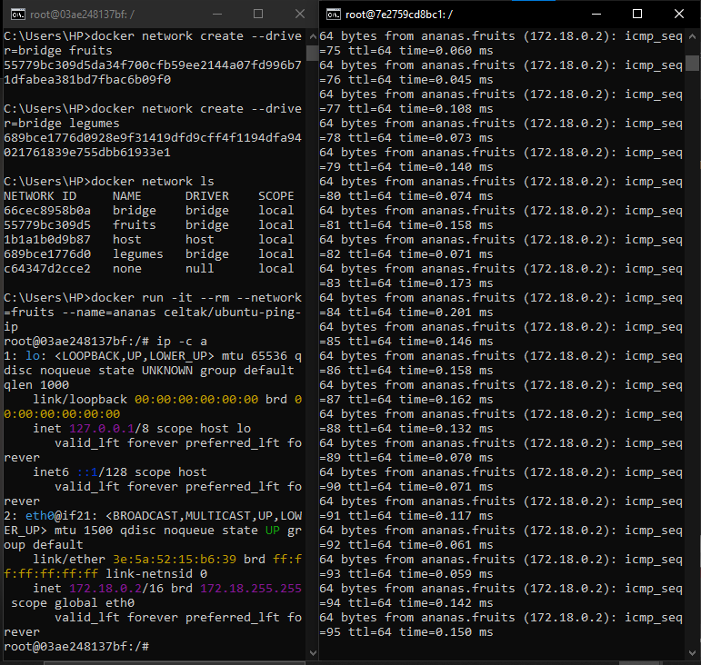
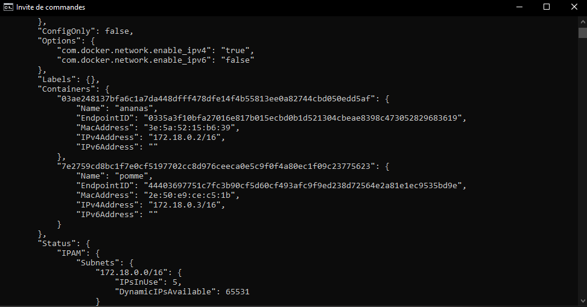

📘 Apprentissage Docker — Réseaux personnalisés
-----------------------------------------------

  

  

  

### 🎯 Objectif

Comprendre comment fonctionnent les **réseaux Docker**, comment **connecter / isoler des conteneurs**, et créer des **réseaux personnalisés** pour permettre la communication entre conteneurs.

* * *

🧠 Concepts appris
------------------

*   Docker crée automatiquement un **réseau bridge par défaut**
    
*   Un conteneur peut être :
    
    *   connecté au réseau `bridge`
        
    *   totalement isolé avec le réseau `none`
        
*   Les conteneurs **ne communiquent que s’ils sont sur le même réseau**
    
*   Il est possible de :
    
    *   créer des réseaux personnalisés
        
    *   connecter/déconnecter des conteneurs manuellement
        
    *   utiliser le **nom du conteneur** au lieu de l’IP pour communiquer
        
*   Inspection et suppression des réseaux Docker
    

* * *

🐳 Image Docker utilisée
------------------------

*   `celtak/ubuntu-ping-ip`  
    👉 Image Ubuntu avec `ping` et `ip` déjà installés
    

* * *

🧪 Commandes Docker apprises aujourd’hui
----------------------------------------

### 🔹 Lister les réseaux Docker

    docker network ls
    

### 🔹 Lancer un conteneur sur un réseau spécifique

    docker run --rm -it --network=bridge celtak/ubuntu-ping-ip
    docker run --rm -it --network=none celtak/ubuntu-ping-ip
    

### 🔹 Vérifier les interfaces réseau dans un conteneur

    ip -c a
    

* * *

### 🔹 Créer des réseaux personnalisés (bridge)

    docker network create --driver=bridge fruits
    docker network create --driver=bridge legumes
    

* * *

### 🔹 Créer et connecter un conteneur directement à un réseau

    docker run -it --rm --network=fruits --name=ananas celtak/ubuntu-ping-ip
    docker run -it --rm --network=fruits --name=pomme celtak/ubuntu-ping-ip
    

* * *

### 🔹 Tester la communication entre conteneurs

    ping pomme
    ping ananas
    

* * *

### 🔹 Créer un conteneur sans réseau spécifique

    docker run --rm -it --name=oignon celtak/ubuntu-ping-ip
    docker run --rm -it --name=poivron celtak/ubuntu-ping-ip
    

* * *

### 🔹 Connecter un conteneur existant à un réseau

    docker network connect legumes oignon
    docker network connect legumes poivron
    

* * *

### 🔹 Inspecter un réseau (voir conteneurs + IP)

    docker network inspect fruits
    

* * *

### 🔹 Déconnecter un conteneur d’un réseau

    docker network disconnect fruits ananas
    docker network disconnect fruits pomme
    docker network disconnect legumes oignon
    docker network disconnect legumes poivron
    

* * *

### 🔹 Supprimer des réseaux Docker

    docker network rm legumes fruits
    

* * *

📌 Types de réseaux Docker vus
------------------------------

*   `bridge`
    
*   `none`
    

### 📖 Autres types (non pratiqués)

*   `host`
    
*   `overlay`
    
*   `macvlan`
    

