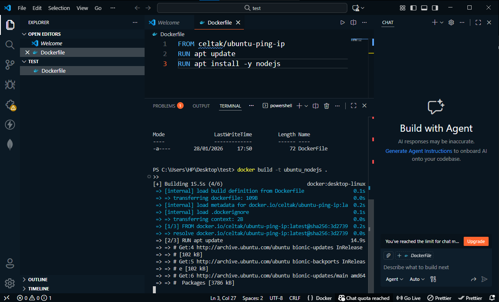

 

# 🐳 Cours Docker – Publier une image sur Docker Hub

    
## 📅 Thème du cours
**Comment publier une image Docker sur Docker Hub**
    
Ce cours explique les étapes nécessaires pour **publier une image Docker créée localement** vers **Docker Hub**, afin de la rendre accessible publiquement ou privéement.
    
---
    
## 🎯 Objectifs du cours
    
- Comprendre ce qu’est Docker Hub
- Lister les images Docker locales
- Tagger correctement une image
- Publier une image sur Docker Hub
- Tester une image publiée
- Comprendre les erreurs courantes
    
---
    
## 📘 Docker Hub
   Docker Hub est un **registre en ligne** qui permet de :
    - stocker des images Docker
    - partager des images avec d’autres développeurs
    - télécharger des images officielles ou personnelles
    
---
    
## 1️⃣ Lister les images locales
    
   ❌ Erreur rencontrée :

   
    
    dockerimages
   

✅ Bonne commande :

    docker images
    

➡️ Cette commande affiche toutes les images disponibles en local.

* * *

2️⃣ Tester le téléchargement d’une image
----------------------------------------

    docker run -it --rm ayoubdev123/celtak
    

📌 Si l’image n’existe pas en local, Docker tente de la télécharger depuis Docker Hub.

* * *

3️⃣ Tagger une image avant publication
--------------------------------------

Avant de publier une image, il faut la **tagger** avec le bon format :

    username/repository:tag
    

Exemple :

    docker tag ubuntu_nodejs ayoubdev123/celtak
    

➡️ `ayoubdev123` : nom d’utilisateur Docker Hub  
➡️ `celtak` : nom du repository  
➡️ `latest` : tag par défaut

* * *

4️⃣ Publier une image sur Docker Hub
------------------------------------

    docker push ayoubdev123/celtak
    

📌 Docker envoie toutes les couches de l’image vers Docker Hub.

* * *

⚠️ Erreurs rencontrées
----------------------

Lors du `docker push`, des erreurs réseau peuvent apparaître :

*   `TLS handshake timeout`
    
*   `no such host`
    
*   problème DNS ou Internet
    

➡️ Ces erreurs sont généralement liées à :

*   une connexion Internet instable
    
*   une configuration proxy manquante
    
*   un problème DNS sur Docker Desktop
    

* * *

5️⃣ Vérifier les images après publication
-----------------------------------------

    docker images
    

➡️ Permet de vérifier que l’image est bien taggée correctement.

* * *

6️⃣ Supprimer une image locale
------------------------------

    docker rmi ubuntu_nodejs
    

➡️ Supprime un tag local sans supprimer l’image si elle a plusieurs tags.

* * *

7️⃣ Lancer l’image publiée
--------------------------

    docker run -it --rm ayoubdev123/celtak
    

### Vérification de Node.js

    node -v
    

✅ Node.js est bien installé dans le conteneur.

* * *

🧾 Commandes Docker utilisées
-----------------------------

| Commande        | Description              |
|----------------|--------------------------|
| docker images  | Lister les images locales |
| docker run     | Lancer un conteneur      |
| docker tag     | Tagger une image         |
| docker push    | Publier une image        |
| docker rmi     | Supprimer une image      |

* * *

✅ Résultat final
----------------

*   ✔️ Image Docker créée localement
    
*   ✔️ Image taggée correctement
    
*   ✔️ Image prête à être publiée sur Docker Hub
    
*   ✔️ Image testée en local avec succès
    

* * *

